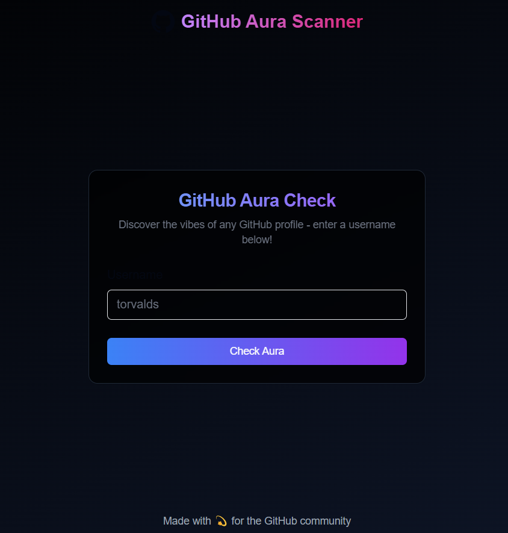
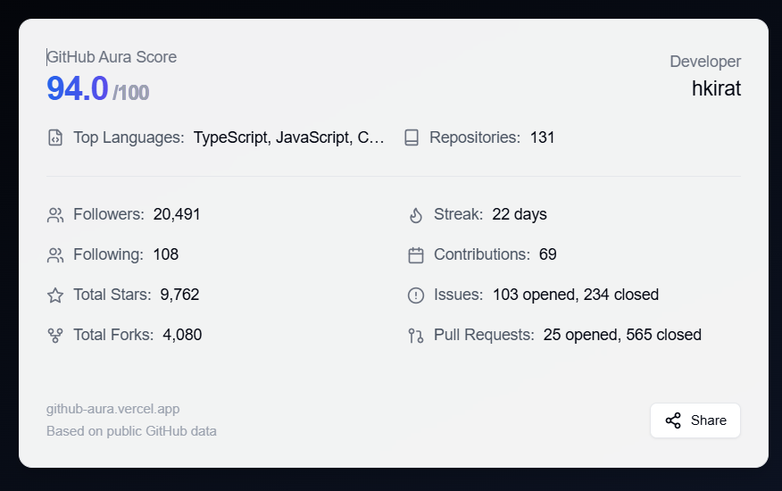
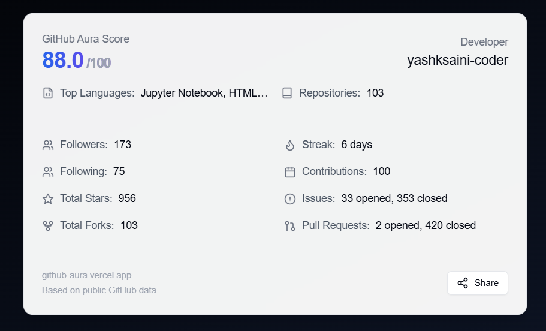

> [!IMPORTANT]
>
> NEXT.js web application that calculate aura score of a github user based on the data fetched from the API endpoint. 

---

    <h3>🚀 <a href="https://github-aura-six.vercel.app/">Live Demo</a> 🚀</h3>
    

### 🛠 Tech Stack

- [React](https://reactjs.org/)
- [Next.js](https://nextjs.org/)
- [Tailwind CSS](https://tailwindcss.com/)
- [Vercel](https://vercel.com/)
- [Octokit](https://octokit.github.io/rest.js/)

### Live Demo

| hkirat | yashksaini-coder |
|----------|------------|
|  |  |

---

<a href="https://github.com/yashksaini-coder">
    <table>
        <tbody>
            <tr>
                <td align="left" valign="top" width="14.28%">
                    
                     
                    <h4 align="center">
                        <b>Yash K. Saini</b>
                    </h4>
                    

                        
(Author)

                    

                </td>
                <td align="left" valign="top" width="85%">
                    

                        👋 Hi there! I'm <u><em><strong>Yash K. Saini</strong></em></u>, a self-taught software developer and a computer science student from India.
                    

                    <ul>
                     <li>
                        I love building & contributing to Open Source software solutions & projects that help solve real-world problems.
                    </li>
                    <li>
                        I want to build products & systems that can benefit & solve problems for many other DEVs.
                    </li>
                </td>
            </tr>
        </tbody>
    </table>
</a>

    <strong>🌟 If you find this project helpful, please give it a star on GitHub! 🌟</strong>

